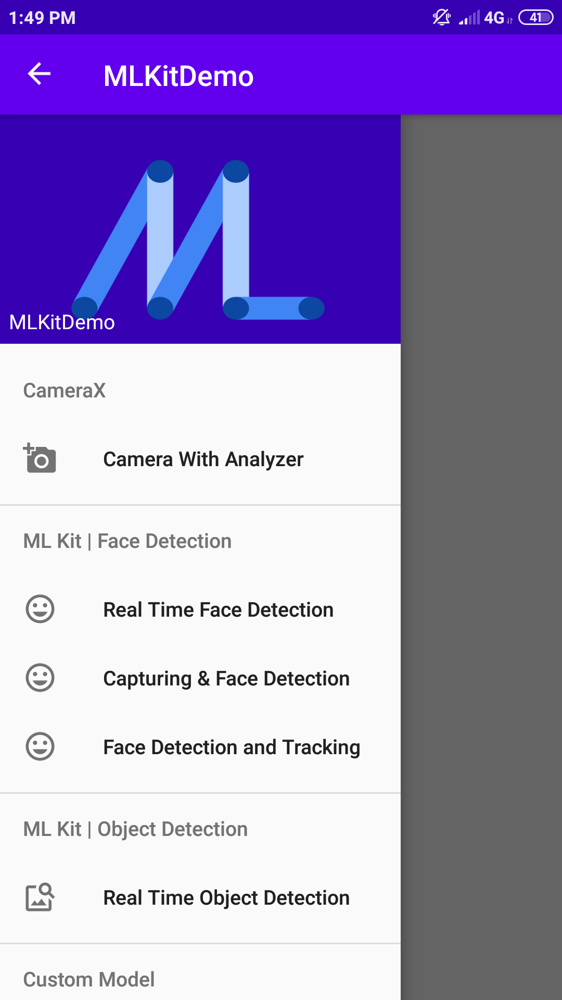
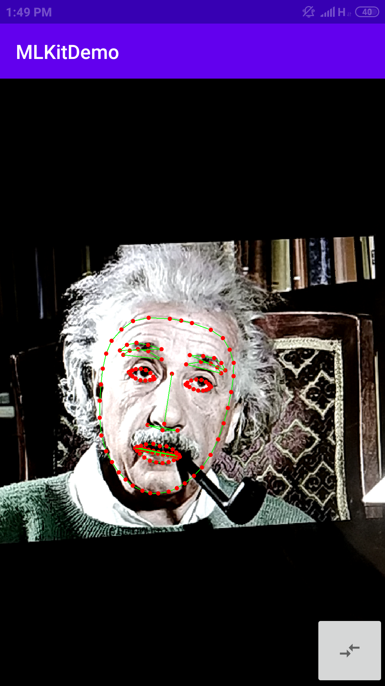
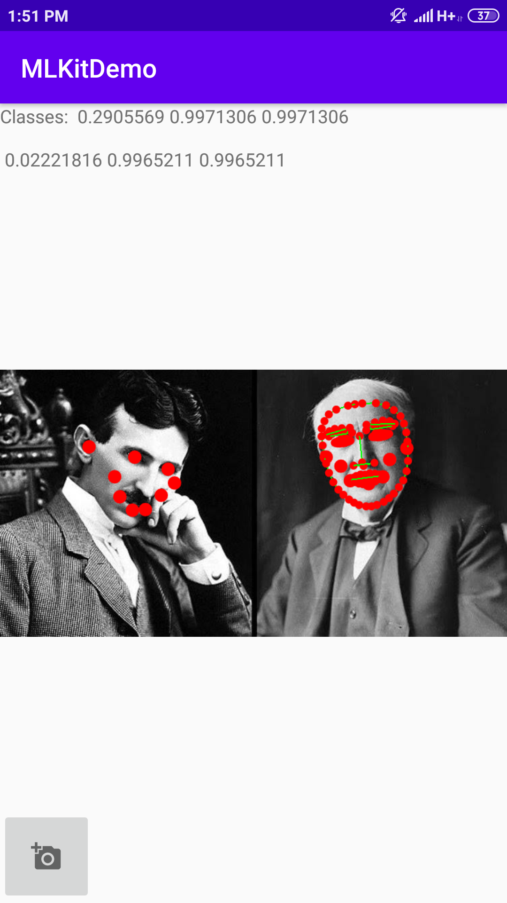
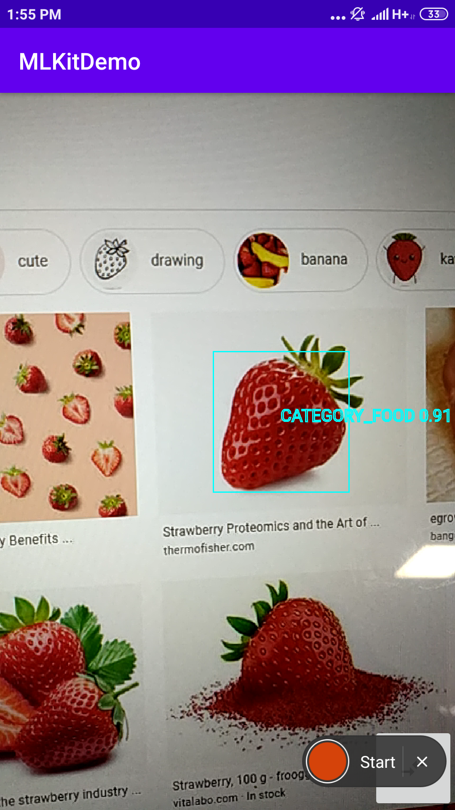
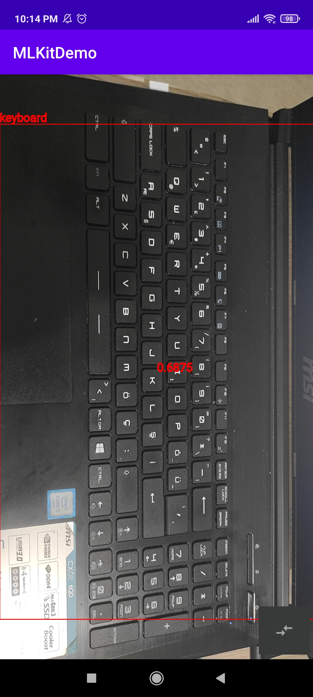

# 🔥 MLKit Demo
A demo app for Firebase ML-Kit which is a mobile SDK provided by Google to bring Google's machine learning expertise to mobile apps in a powerful yet easy-to-use way

> ML-kit is in beta release for now 👩‍🔬

## 📱 About the app
The app contains various examples of ML-Kit (Vision part), each example is presented as a single activity (All in one app 🤭)

## 💫 Available Examples

### 📸 Camera
- [📷 CameraX example](app/src/main/java/com/asmaamir/mlkitdemo/CameraX): Preview, Capture and Analyze functionalities 🤹‍♀️ 

### 💼 ML Kit Models
- [👩‍🚀 Real time face detection](app/src/main/java/com/asmaamir/mlkitdemo/RealTimeFaceDetection): Contour detecting 
- [🎴 Face detection from a picked image](app/src/main/java/com/asmaamir/mlkitdemo/CaptureFaceDetection): Contour, landmarks and face classification
- [🕵️‍♀️ Face detection and tracking](app/src/main/java/com/asmaamir/mlkitdemo/FaceTracking): Tracking faces over frames
- [🌞 Real time object detection](app/src/main/java/com/asmaamir/mlkitdemo/RealTimeObjectDetection): Object detection and classification

### 🚀 Custom Models (Local 📍)
- [🕵️‍♀️ Object Detection](app/src/main/java/com/asmaamir/mlkitdemo/CustomModelDetection)
> Still has drawing issue 🙄

#### 🎁 Used Models
- Object Detection: [👀 COCO SSD MobileNet v1](https://www.tensorflow.org/lite/models/object_detection/overview#performance_benchmarks)

## 🛑 Note
- 👮‍♀️ Presented codes are not optimized, since it is a demo it aims **simplicity**
- 🔎 Check out best practices that will be suitable to your project

## 🐞 Known Bug
- 🙄 Face contour detection functionality can detect contours of an only single face in the image 
  - [👀 Stack Overflow](https://stackoverflow.com/q/57203678)
- 👩‍💻 Please tell me if you have a solution

## 🤳 Screenshots
### 📝 Nav Menu

	

### 👩‍🚀 Real Time Face Detection

	

### 🎴 Face Detection From a Picked Image

	

### 🌞 Real Time Object Detection

	

### 🕵️‍♀️ Face Detection and Tracking

	

### 🚀 Custom Object Detection

	

## 💼 Contact and Support
Find me on [LinkedIn](https://www.linkedin.com/in/asmaamirkhan/) and feel free to mail me, [Asmaa 🦋](mailto:asmaamirkhan.am@gmail.com)

